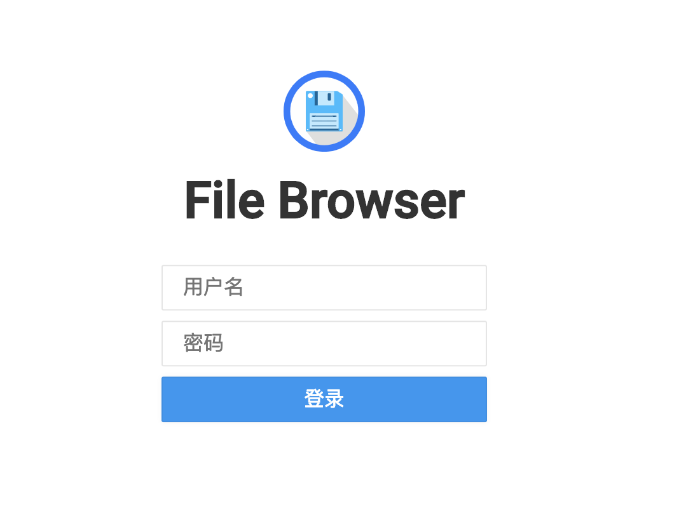

# itumate-app-storage

itumate 存储服务 APP

`itumate-app-storage` 服务文件存储服务使用的是 Github 开源项目 [FileBrowser](https://github.com/filebrowser/filebrowser)，该项目
由 Go 语言编写。

# FileBrowser 存储服务搭建

FileBrowser 环境搭建可以参考： [米 V 米 File Browser 安装及使用](https://www.mivm.cn/filebrowser/)。

这里介绍下脚本安装。你可以直接执行 [get-filebrowser.sh](./get-filebrowser.sh) 进行获取安装包文件，另外你也可以直接执行如下命令（建议）进行获取：

```
$ curl -fsSL https://filebrowser.github.io/get.sh | bash
 or
$ wget -qO- https://filebrowser.github.io/get.sh | bash
```

上诉脚本或命令执行完成后会将下载的安装包文件存储在 `/usr/local/bin` 目录下：

```
$ ls /usr/local/bin/
filebrowser
```

得到 `filebrowser` 文件后，将脚本 [init-filebrowser-config.sh](./init-filebrowser-config.sh) 上传到 `/usr/local/bin/` 目录下（
与 `filebrowser` 文件同级）。该脚本文件用于初始化配置，具体配置如下信息：

- 初始化服务端口：`39494`
- 初始化日志输出信息：`/var/log/filebrowser.log`
- 初始化超级管理员用户：用户名（`admin`）、密码（`admin123`）
- 初始化文件存储位置：`/home/data/filebrowser`

> 以上信息可以自行修改

继续下载 File Browser 的 service 文件：

```
$ curl https://cdn.mivm.cn/www.mivm.cn/archives/filebrowser/filebrowser.service -o /lib/systemd/system/filebrowser.service
```

管理 File Browser 服务：

- 运行：`systemctl start filebrowser.service`

- 停止运行：`systemctl stop filebrowser.service`

- 开机启动：`systemctl enable filebrowser.service`

- 取消开机启动：`systemctl disable filebrowser.service`

- 查看运行状态：`systemctl status filebrowser.service`

- 杀死进程：`kill -9 $(pidof filebrowser)`

如果你不知道配置服务端口，启动服务后可以执行如下命令进行查看：

```
$ netstat -anupt | grep filebrowser

# 示例
tcp6       0      0 :::39494                :::*                    LISTEN      10680/filebrowser  
```

以上配置执行完成后即可访问 File Browser 存储服务，`启动服务` 后即可在浏览器中输入 `ip:<port>` 进行访问，如果你是直接执行初始化配置文件则端口
为 `39494`。登录界面如下所示：



具体相关配置信息可以参考官方文档：https://docs.filebrowser.xy

# 项目配置

在配置文件 `application-dev.properties` 中配置如下信息：

```
# 服务地址
file.browser.base.path=http://<ip>:<port>
# 登录用户
file.browser.login.username=admin
# 登录密码
file.browser.login.password=admin123
# 登录地址(不需修改)
file.browser.login.path=/api/login
# 上传路径(不需修改)
file.browser.upload.path=/api/resources
# 查看文件路径(不需修改)
file.browser.file.show=/api/raw
```

实际中只需要修改如下三个信息即可，api 无需任何修改

```
file.browser.base.path=
file.browser.login.username=
file.browser.login.password=
```